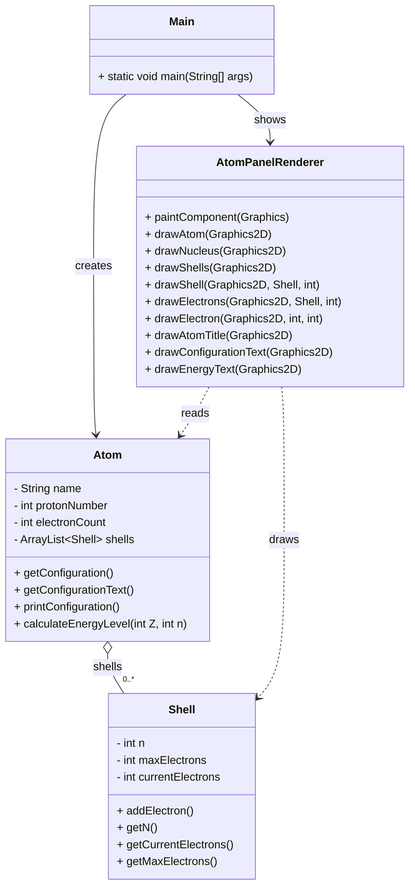

# Schalenmodell - Architektur in Java

```yaml
Main
│
├── Atom (Atom.java)
│     ├── - name: String
│     ├── - protonNumber: int
│     ├── - electronCount: int
│     ├── - shells: ArrayList<Shell>
│     ├── + getConfiguration()            # verteilt Elektronen auf Schalen
│     ├── + getConfigurationText()        # gibt Konfiguration als mehrzeiligen String zurück
│     ├── + printConfiguration()          # Console-Ausgabe der Konfiguration
│     └── + calculateEnergyLevel(Z,n)     # Berechnung E_n = -13.6 * Z^2 / n^2
│
├── Shell (Shell.java)
│     ├── - n: int
│     ├── - maxElectrons: int
│     ├── - currentElectrons: int
│     ├── + addElectron()                 # erhöht currentElectrons bis max
│     ├── + getN()
│     ├── + getCurrentElectrons()
│     └── + getMaxElectrons()
│
└── AtomPanelRenderer (AtomPanelRenderer.java)
	├── + paintComponent()
	├── + drawAtom()
	├── + drawNucleus()
	├── + drawShells()
	├── + drawShell()
	├── + drawElectrons()
	├── + drawElectron()
	├── + drawAtomTitle()
	├── + drawConfigurationText()
	└── + drawEnergyText()

Optional:
	- Main.java: erstellt ein Atom-Objekt, ruft getConfiguration() auf und öffnet ein JFrame mit new AtomPanelRenderer(atom)
```

## Mermaid-Diagramm



---

**Author** : kuranez